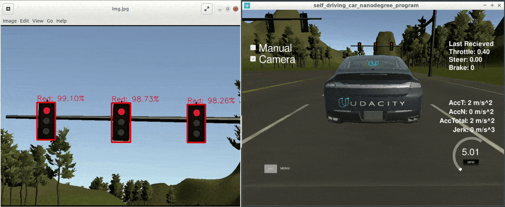

# Capstone project - Team Hot Wheels

[](LICENSE)  [](https://www.codacy.com/manual/frgfm/sdcnd-capstone?utm_source=github.com&amp;utm_medium=referral&amp;utm_content=frgfm/sdcnd-capstone&amp;utm_campaign=Badge_Grade)   

Capstone project of Udacity Self-Driving Car Nanodegree (cf. [repo](https://github.com/udacity/CarND-Capstone)).



**Team Hot Wheels**

- [François-Guillaume Fernandez](https://github.com/frgfm) (Team Lead)
- [Guisheng Wang](https://github.com/guishengwang)
- [Ahmad Kamal](https://github.com/dringakn)
- [Peter Chen](https://github.com/peter-c12)
- [Yue Leng](https://github.com/cathylengyue)


##### Table of Contents

- [Getting Started](#getting-started)
  - [Prerequisites](#prerequisites)
  - [Installation](#installation)
- [Usage](#usage)
- [Approach](#approach)
- [Credits](#credits)
- [License](#license)


## Getting started

### Prerequisites

- [Unity3D](https://unity3d.com/get-unity/download): 3D game engine used for our simulation.

### Installation

This is the project repo for the final project of the Udacity Self-Driving Car Nanodegree: Programming a Real Self-Driving Car. For more information about the project, see the project introduction [here](https://classroom.udacity.com/nanodegrees/nd013/parts/6047fe34-d93c-4f50-8336-b70ef10cb4b2/modules/e1a23b06-329a-4684-a717-ad476f0d8dff/lessons/462c933d-9f24-42d3-8bdc-a08a5fc866e4/concepts/5ab4b122-83e6-436d-850f-9f4d26627fd9).

Please use **one** of the two installation options, either native **or** docker installation.

#### Native Installation

* Be sure that your workstation is running Ubuntu 16.04 Xenial Xerus or Ubuntu 14.04 Trusty Tahir. [Ubuntu downloads can be found here](https://www.ubuntu.com/download/desktop).
* If using a Virtual Machine to install Ubuntu, use the following configuration as minimum:
  * 2 CPU
  * 2 GB system memory
  * 25 GB of free hard drive space

  The Udacity provided virtual machine has ROS and Dataspeed DBW already installed, so you can skip the next two steps if you are using this.

* Follow these instructions to install ROS
  * [ROS Kinetic](http://wiki.ros.org/kinetic/Installation/Ubuntu) if you have Ubuntu 16.04.
  * [ROS Indigo](http://wiki.ros.org/indigo/Installation/Ubuntu) if you have Ubuntu 14.04.
* [Dataspeed DBW](https://bitbucket.org/DataspeedInc/dbw_mkz_ros)
  
  * Use this option to install the SDK on a workstation that already has ROS installed: [One Line SDK Install (binary)](https://bitbucket.org/DataspeedInc/dbw_mkz_ros/src/81e63fcc335d7b64139d7482017d6a97b405e250/ROS_SETUP.md?fileviewer=file-view-default)
* Download the [Udacity Simulator](https://github.com/udacity/CarND-Capstone/releases).

#### Docker Installation
[Install Docker](https://docs.docker.com/engine/installation/)

Build the docker container
```bash
docker build . -t capstone
```

Run the docker file
```bash
docker run -p 4567:4567 -v $PWD:/capstone -v /tmp/log:/root/.ros/ --rm -it capstone
```

#### Runtime dependencies

Install the dependencies to run the Python code on each ROS node:

```
cd sdcnd-captstone
pip install -r requirements.txt
wget https://github.com/frgfm/sdcnd-capstone/releases/download/v0.1.0/faster_rcnn_resnet50_coco_finetuned.pb
mv faster_rcnn_resnet50_coco_finetuned.pb ros/src/tl_detector/light_classification/
```

#### Unity

After installing Unity3D, you will need an environment build to run the simulation. Download the appropriate build for your OS and extract it:

- [Linux](https://github.com/udacity/CarND-Capstone/releases/download/v1.3/linux_sys_int.zip)
- [MacOS](https://github.com/udacity/CarND-Capstone/releases/download/v1.3/mac_sys_int.zip)
- [Windows](https://github.com/udacity/CarND-Capstone/releases/download/v1.3/win_sys_int.zip)

If you encounter an issue with the above builds, please refer to the "Available Game Builds" section of this [readme](https://github.com/udacity/self-driving-car-sim).

## Usage

#### Styx

Now you should be able to build the project and run the styx server:

```bash
cd ros
catkin_make
source devel/setup.sh
roslaunch launch/styx.launch
```

#### 

#### Real world testing
1. Download [training bag](https://s3-us-west-1.amazonaws.com/udacity-selfdrivingcar/traffic_light_bag_file.zip) that was recorded on the Udacity self-driving car.
2. Unzip the file
```bash
unzip traffic_light_bag_file.zip
```
3. Play the bag file
```bash
rosbag play -l traffic_light_bag_file/traffic_light_training.bag
```
4. Launch your project in site mode
```bash
cd sdncd-capstone/ros
roslaunch launch/site.launch
```
5. Confirm that traffic light detection works on real life images

#### Other library/driver information
Outside of `requirements.txt`, here is information on other driver/library versions used in the simulator and Carla:

Specific to these libraries, the simulator grader and Carla use the following:

|        | Simulator | Carla  |
| :-----------: |:-------------:| :-----:|
| Nvidia driver | 384.130 | 384.130 |
| CUDA | 8.0.61 | 8.0.61 |
| cuDNN | 6.0.21 | 6.0.21 |
| TensorRT | N/A | N/A |
| OpenCV | 3.2.0-dev | 2.4.8 |
| OpenMP | N/A | N/A |

We are working on a fix to line up the OpenCV versions between the two.


## Approach

This project involves an agent (vehicle on a highway) exposed to a continuous state space and continuous action space. The environment can be switched to manual mode to give controls to the user, by default the only accepted inputs are the default controls communicated by [ROS](http://wiki.ros.org/) through a [WSGI](https://wsgi.readthedocs.io/en/latest/) application.

### Environment

This Unity environment gives a large state space with inherent constraints on the agent state. 


In manual mode, if we violate common highway driving rules, warnings will be thrown. The environment will have the car position to strictly take values in what the controller sends and will expose both the agent state and sensor measurements to our codebase.

Please refer to this [repository](https://github.com/udacity/self-driving-car-sim) for further details.


#### Goals

- Respect traffic lights stops
- Comply with speed limits
- Keep the lane along the way


In the `ros/src` folder, you will different nodes:

- `tl_detector`: responsible for object detection on traffic lights
- `twist_controller`: responsible for vehicle controls
- `waypoint_follower`: responsible for trajectory following
- `waypoint_loader`: loads the waypoints on the map (position of traffic lights)
- `waypoint_updater`: selects an appropriate behavior based on `tl_detector` information.

#### Perception


This node is responsible for detecting traffic lights in range and classify their color for the planning module to work. For inference speed, we could have selected single-shot detectors such as SSD or YOLOv3, but as a first attempt, we used Faster RCNN for performance reasons.


It is available on [TensorFlow model zoo](https://github.com/tensorflow/models/blob/master/research/object_detection/g3doc/detection_model_zoo.md), and is a well-known architecture used by some self-driving car makers for their own vehicles. The dataset of [Alex Lechner](https://github.com/alex-lechner/Traffic-Light-Classification#2-the-diligent-approach) was used for training to avoid manually labeling a dataset as well as its [instructions](https://github.com/alex-lechner/Traffic-Light-Classification#training) for training models on it. 


For efficiency purposes, we only do model inference when the traffic light is in close range since the information is not actionable beforehand.


#### Planning


The planning node publishes waypoints for the vehicle to follow, along with the velocity for each one of them. We had to reduce the default number of waypoints to avoid significant lags on workspace, down to 20.

#### Control


Udacity provided an [Autoware](https://www.autoware.org/) ROS node that will publish the twist commands for linear and angular velocities


### Results

The previously mentioned implementation yields a smooth driving agent able to evolve in the highway environment. For better insights on the perception module, the below visualization include another window with the output of the object detection model.


The trained object detection model is available for download [here](https://github.com/frgfm/sdcnd-capstone/releases/download/v0.1.0/faster_rcnn_resnet50_coco_finetuned.pb).

The full-length lap recording is available for download in the release attachments:

- [Session 1](https://github.com/frgfm/sdcnd-capstone/releases/download/v0.1.0/capstone_session1.mp4)
- [Session 2](https://github.com/frgfm/sdcnd-capstone/releases/download/v0.1.0/capstone_session2.mp4)


## Credits

This implementation is of my own design but widely uses the following methods and concepts:

- Object detection papers: [Faster-RCNN](https://arxiv.org/abs/1506.01497), [SSD](https://arxiv.org/abs/1512.02325), [YOLOv3](https://arxiv.org/abs/1804.02767)
- Traffic light dataset: [Alex Lechner dataset](https://github.com/alex-lechner/Traffic-Light-Classification#2-the-diligent-approach)
- Model pretrained models: [TensorFlow model zoo](https://github.com/tensorflow/models/blob/master/research/object_detection/g3doc/detection_model_zoo.md)


## License

Distributed under the MIT License. See `LICENSE` for more information.